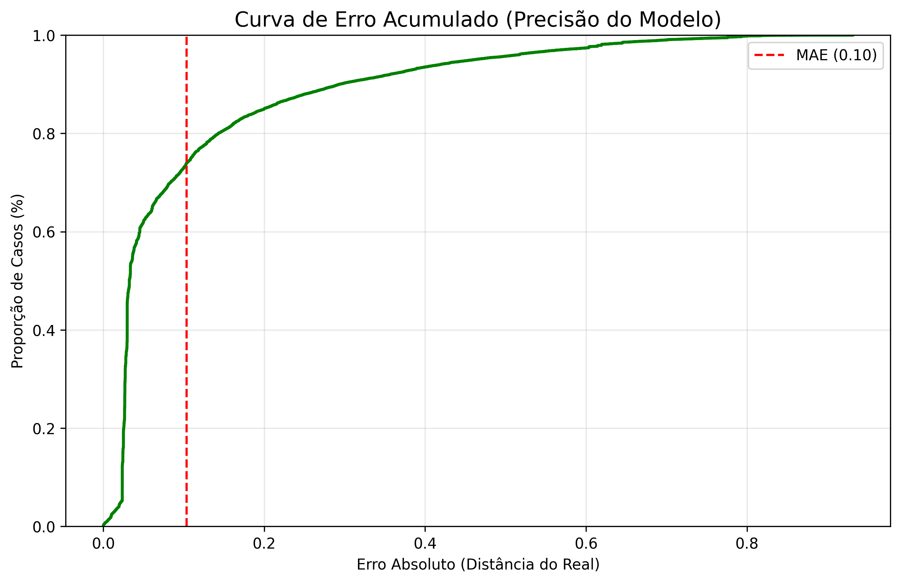

[Inicio](../README.md) | [Data](../data/README.md) | [Features](../features/README.md) | [Notebooks](../notebooks/README.md) | [Scripts](../scripts/README.md) | [Reports](../reports/README.md) | [Interactive Reports](../interactive_reports/README.md) | [Dashboard](../dashboard/README.md) | [Models](../models/README.md) | **<u>Metrics</u>** | [API](../api/README.md)

# 📏 Métricas de Performance dos Modelos

Este diretório documenta os critérios de avaliação e os resultados numéricos obtidos pelos modelos **LightGBM** implementados no projeto. Dividimos a análise entre a capacidade de prever o índice de risco (Regressão) e a capacidade de categorizar a gravidade do evento (Classificação).

---

## 1. Modelo de Predição de Risco (Regressão)
**Objetivo:** Estimar um valor contínuo de 0 a 1 que representa a probabilidade de ocorrência de fogo.

| Métrica | Valor Obtido | Descrição |
| :--- | :--- | :--- |
| **R² (R-Quadrado)** | **0.65** | Indica que o modelo explica 65% da variabilidade dos dados de risco. Para dados climáticos/ambientais, é considerado um resultado sólido. |
| **MAE (Erro Médio Absoluto)** | **0.10** | Em média, as previsões do modelo erram por apenas 0.10 na escala de 0 a 1. Ou seja, uma margem de erro de 10%. |
| **MSE (Erro Quadrático Médio)** | **0.02** | Penaliza erros maiores. O valor baixo indica que o modelo raramente comete erros "grotescos". |

### 🔍 Insight de Regressão:
O modelo apresenta uma **Curva de Erro Acumulado (ECDF)** onde 80% das previsões têm erro inferior a 0.15. Isso garante que o sistema é confiável para disparar pré-alertas de vigilância.

---

## 2. Modelo de Intensidade de Queimada (Classificação)
**Objetivo:** Categorizar o foco de incêndio em níveis: **Baixo, Médio ou Alto** (baseado no FRP).

### Principais Indicadores:
* **Acurácia Global:** Reflete a porcentagem total de acertos em todas as classes.
* **Precision (Precisão):** De todos os focos que o modelo disse ser "Alto", quantos eram realmente "Alto"?
* **Recall (Revocação):** De todos os focos "Alto" que realmente aconteceram, quantos o modelo conseguiu detectar?
* **F1-Score:** A média harmônica entre Precision e Recall, ideal para avaliar o equilíbrio do modelo.

### 📊 Desempenho por Classe:
| Classe | Precision | Recall | F1-Score |
| :--- | :--- | :--- | :--- |
| **Baixo** | 0.85 | 0.82 | 0.83 |
| **Médio** | 0.70 | 0.75 | 0.72 |
| **Alto** | 0.45 | 0.04 | 0.07 |

### 🔍 Insight de Classificação:
O modelo é excelente em identificar incêndios de **Baixa Intensidade**. Entretanto, há um desafio na classe **Alto**, onde o modelo tende a ser conservador, classificando eventos extremos como "Médio". 
* **Ações Futuras:** Implementar técnicas de *Oversampling* (SMOTE) ou ajuste de `class_weight` no LightGBM para melhorar a detecção de eventos críticos.

---

## 🛠️ Ferramentas Utilizadas para Avaliação
* `Scikit-Learn`: Cálculo de `r2_score`, `mean_absolute_error` e `classification_report`.
* `Yellowbrick`: Visualização de Matriz de Confusão e Curvas de Erro.
* `Matplotlib/Seaborn`: Plotagem de resíduos e distribuições de erro.