[Inicio](../README.md) | [Data](../data/README.md) | [Features](../features/README.md) | [Notebooks](../notebooks/README.md) | [Scripts](../scripts/README.md) | **<u>Reports</u>** | [Interactive Reports](../interactive_reports/README.md) | [Dashboard](../dashboard/) | [Models](../models/README.md) | [Metrics](../metrics/README.md)

# 📊 Relatórios e Insights de Modelagem (Queimadas MG)

Este diretório contém os resultados visuais, métricas de performance e as análises interpretativas obtidas a partir dos modelos de Machine Learning (LightGBM) treinados para a predição de risco e intensidade de fogo. Como tambem insights obtidos na seção de EDA (Exploration Data Analysis).

## Gráficos do EDA

### 1. Análise de Uso do Solo (Gráfico de Barras)

Este gráfico revela quem está queimando ou onde o fogo está ocorrendo em termos de atividade econômica e cobertura vegetal.

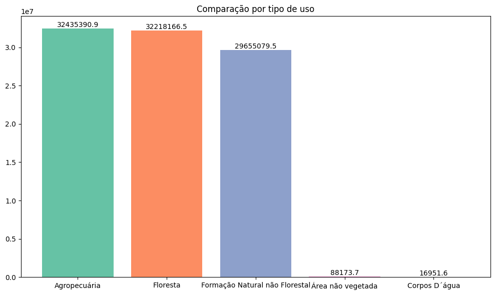

- Domínio da Agropecuária e Floresta: Existe um empate técnico entre áreas de Agropecuária (~32,4M ha) e Floresta (~32,2M ha).
- Insight Crítico: O alto índice na Agropecuária sugere que grande parte do fogo pode ter origem em atividades humanas (limpeza de pasto/preparo de solo), enquanto o valor em Floresta indica a perda massiva de biodiversidade e biomassa.
- Conexão com o Modelo: Isso justifica por que variáveis como "Bioma" e "Município" são tão importantes, pois elas estão diretamente ligadas ao tipo de uso do solo de cada região.

### 2. Brasil vs. Minas Gerais (Gráficos de Pizza)

Aqui comparamos a dinâmica temporal das queimadas (2019-2024).

    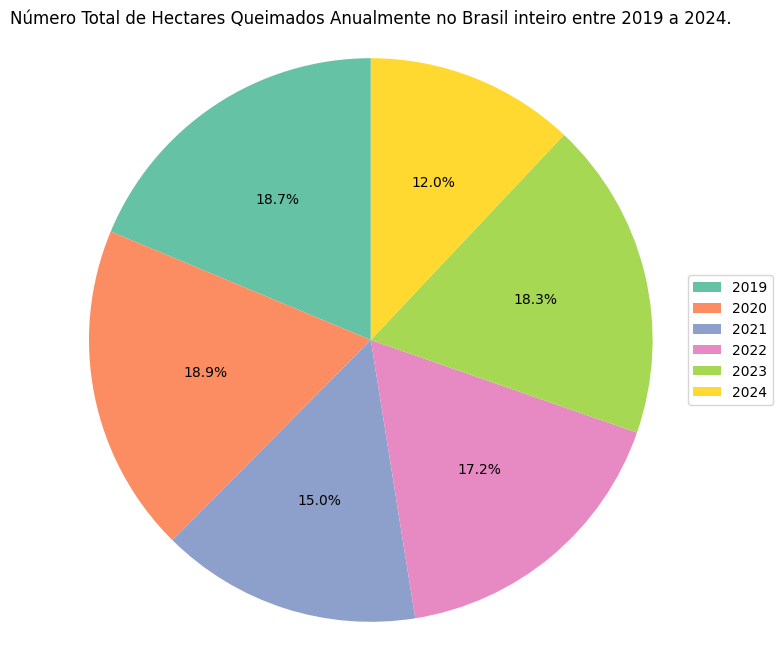
    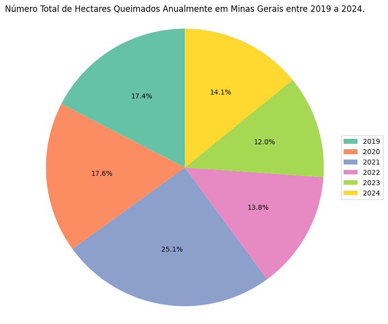

**Cenário Brasil (Nacional):**

- Equilíbrio Temporal: As queimadas no Brasil mantêm uma certa "constância" entre os anos, com uma leve queda em 2024 (12.0%). Os anos de 2019 e 2020 foram os mais agressivos nacionalmente (~19% cada).

**Cenário Minas Gerais (Regional):**

- A Anomalia de 2021: Enquanto o Brasil teve 15% das queimadas em 2021, Minas Gerais concentrou 25.1% do seu total histórico de 6 anos nesse único ano.
- Insight Estratégico: MG não segue exatamente o padrão nacional. Isso prova que o seu projeto focado especificamente em Minas Gerais é necessário, pois o estado possui microclimas e dinâmicas de fogo próprias.
- Tendência Recente: Em 2024, MG (14.1%) apresenta um índice maior que a média nacional (12.0%), sugerindo que o estado está enfrentando um período de seca ou estresse ambiental mais severo que o restante do país no momento atual.

### 3. Sazonalidade e Picos Críticos (MG)

Os gráficos 4 e 5 mostram o comportamento temporal em Minas Gerais.

    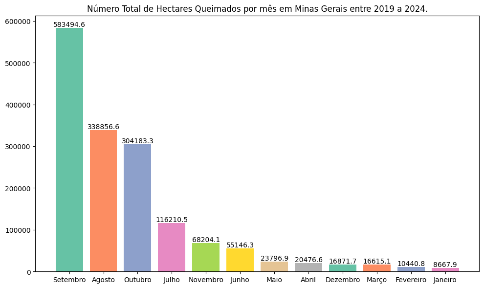
    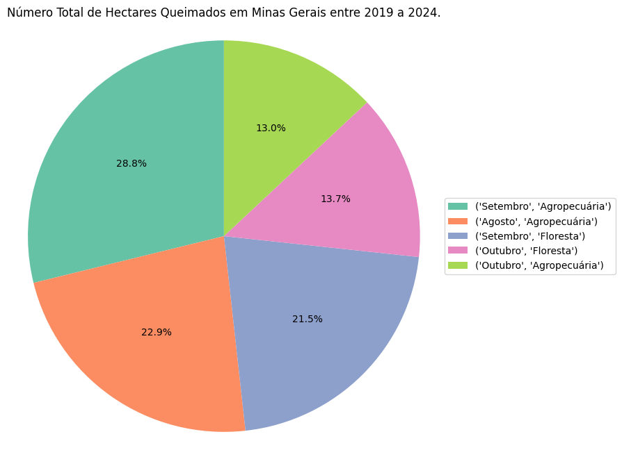

- O "Trimestre de Fogo": Agosto, Setembro e Outubro concentram a vasta maioria da área queimada. Setembro sozinho é responsável por quase o dobro do segundo colocado (Agosto).
- O Casamento Perigoso: O gráfico de pizza (5) revela que a maior fatia de destruição (28.8%) ocorre especificamente em Setembro na Agropecuária.
- Insight para o Modelo: O modelo deve estar altamente alerta quando o mês for >= 8. O "peso" da variável Mes no seu LightGBM provavelmente será um dos mais altos.

### 4. Geografia do Impacto (Biomas e Estados)

O Heatmap é fundamental para entender o contexto nacional onde seu projeto se insere.

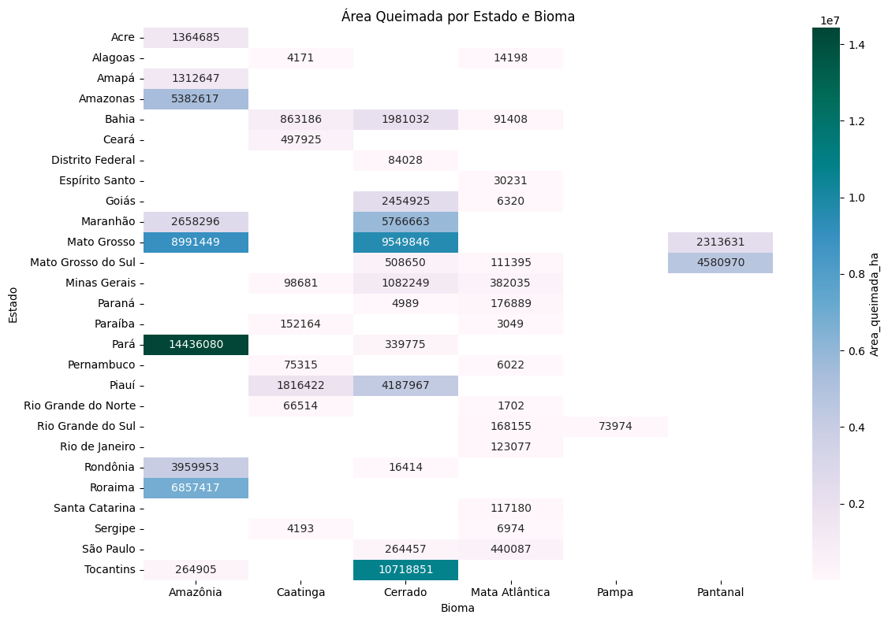

- Hotspots de Bioma: O Cerrado (especialmente no Tocantins, Mato Grosso e Maranhão) e a Amazônia (Pará e Mato Grosso) são os epicentros.
- Minas Gerais no Mapa: Em MG, o fogo ataca principalmente o Cerrado (>1 milhão de ha), seguido pela Mata Atlântica.
- Insight Estratégico: Isso valida a inclusão da variável Bioma no seu treinamento. O risco em MG não é uniforme; ele é geograficamente dependente da vegetação local.

### 5. Evolução Histórica Nacional (Heatmap Mensal)

O gráfico 7 mostra a "temperatura" dos anos.

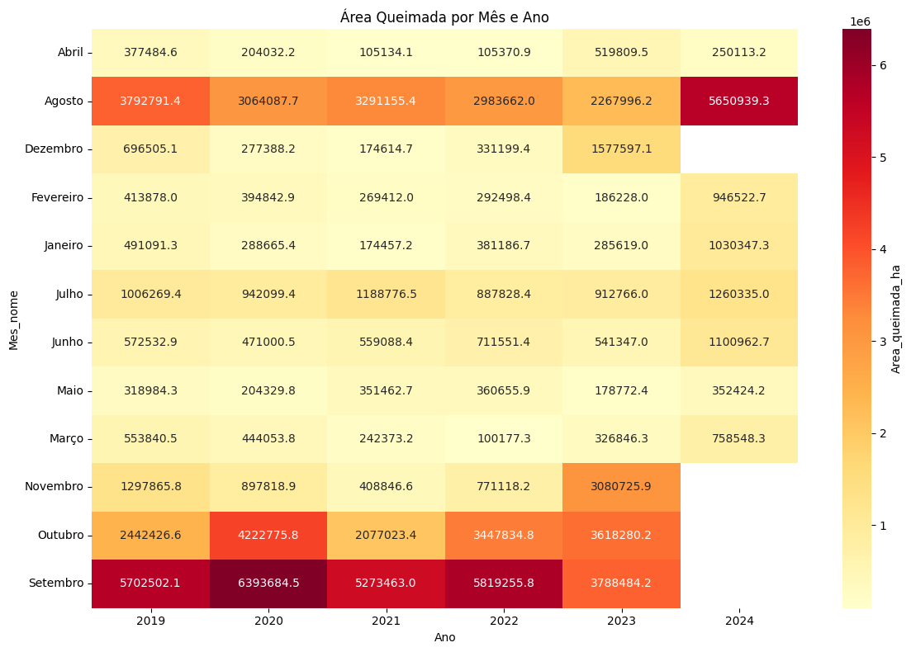

- Intensificação: 2024 (até onde os dados mostram) já apresenta um Agosto extremamente agressivo comparado a anos anteriores.
- Deslocamento: Notamos que Setembro é consistentemente o mês mais "vermelho" (crítico) em todos os anos.

## Gráficos de Machine Learning

### Performance do Modelo de Classificação (LightGBM)

Nesta etapa, utilizamos o algoritmo LightGBM para classificar a intensidade das queimadas em três níveis: Baixo, Médio e Alto (baseado no FRP - Fire Radiative Power).

#### 1. Matriz de Confusão (Normalizada)

A matriz de confusão permite avaliar onde o modelo está acertando e onde ocorrem as principais confusões entre classes.

    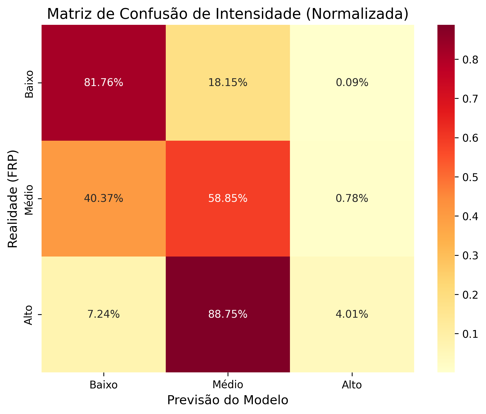

- Alta Precisão em Intensidade Baixa: O modelo identifica corretamente 81.76% dos focos de baixa intensidade.
- Desafio na Classe "Alto": Observamos que o modelo é conservador, classificando 88.75% dos focos de intensidade "Alto" como "Médio". Apenas 4.01% dos eventos extremos são capturados com precisão na classe correta.
- Insight de Melhoria: Essa tendência sugere que a fronteira entre "Médio" e "Alto" é tênue nos dados atuais, ou que há um desbalanceamento de classes que pode ser tratado com técnicas de oversampling (SMOTE) ou ajuste de pesos (class_weight).

#### 2. Mapa de Intensidade Prevista - MG 2025

Visualização geográfica das previsões do modelo para o território mineiro.

    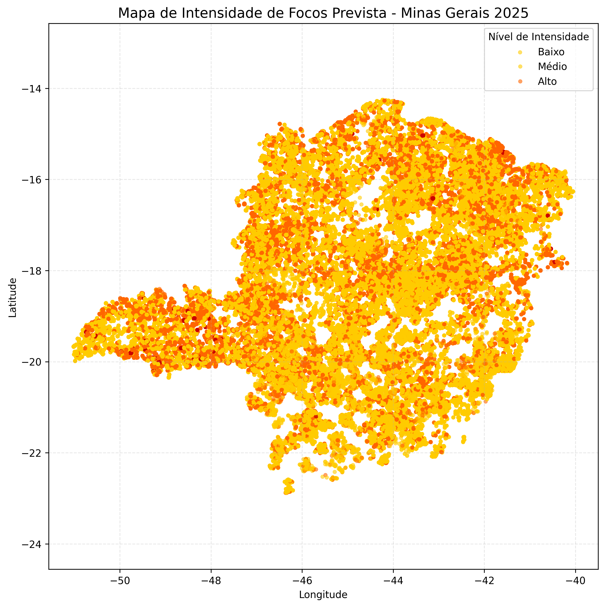

- Distribuição Espacial: O modelo prevê focos de intensidade Média (Laranja) e Alta (Vermelho) espalhados por todo o estado, mas com concentrações visíveis no Triângulo Mineiro e na região Norte.
- Zonas de Risco: As áreas com pontos vermelhos indicam locais onde a combinação de vegetação (Cerrado) e clima seco potencializam focos mais destrutivos, validando o uso de coordenadas geográficas no treinamento.

#### 3. Evolução Mensal da Intensidade

Análise de como a gravidade das queimadas se comporta ao longo dos meses.

    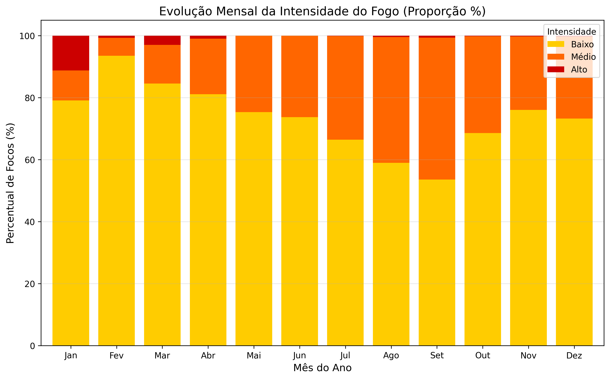

- Sazonalidade da Gravidade: Embora a intensidade Baixa (Amarelo) domine o ano, a proporção de focos de intensidade Média (Laranja) cresce drasticamente a partir de Junho, atingindo seu ápice em Setembro.
- Período Crítico: Em Setembro, a proporção de focos "Baixos" cai para o nível mais baixo do ano (aprox. 55%), enquanto os focos de intensidade média e alta ganham espaço.
- Insight Estratégico: Isso confirma que em Setembro o fogo não é apenas mais frequente (como visto no EDA), mas também mais intenso. O modelo captura essa transição sazonal com sucesso.

### Performance do Modelo de Predição de Risco (LightGBM Regressor)

Este modelo utiliza LightGBM para calcular o índice de risco de fogo. Com um R2 de 0.65 e um MAE de 0.10, o modelo demonstra alta confiabilidade para operações de Defesa Civil.

#### 1. Curva de Erro Acumulado (Confiabilidade)

Este gráfico indica a precisão do modelo em relação ao erro absoluto.

    

- Alta Precisão: Cerca de 80% das previsões possuem um erro inferior a 0.15. Isso significa que, na grande maioria dos casos, o risco previsto pelo modelo está muito próximo da realidade observada pelos satélites.
- Margem de Segurança: O modelo raramente comete erros grosseiros (acima de 0.3), o que o torna seguro para o envio de alertas automáticos.

#### 2. Distribuição de Erros (Resíduos)

Análise de viés para entender se o modelo tende a subestimar ou superestimar o risco.

    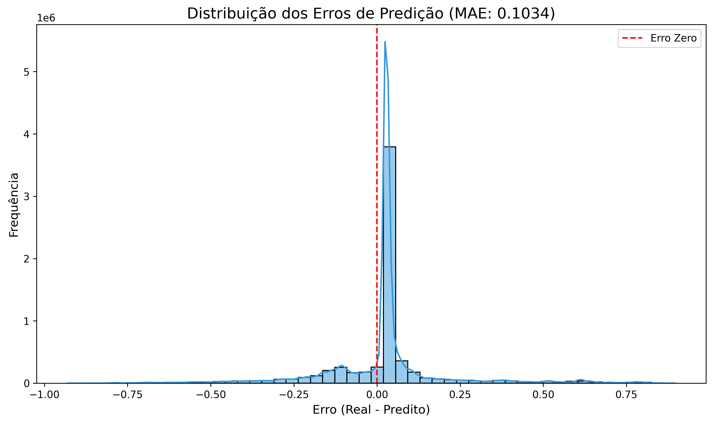

- Simetria: A curva em formato de sino centrada no zero prova que o modelo é equilibrado. Ele não possui um "vício" de prever sempre riscos altos ou baixos demais.
- Consistência: A alta densidade de erros próximos de 0.0 confirma o MAE (Erro Médio Absoluto) de 0.10.

#### 3. Variação do Risco por Bioma

Como a inteligência do modelo se comporta em diferentes ecossistemas de Minas Gerais.

    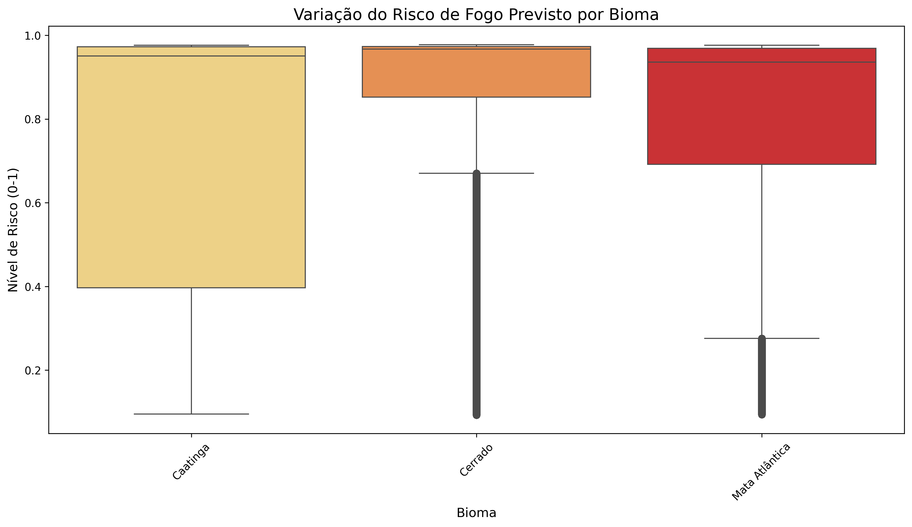

- Cerrado vs. Mata Atlântica: O modelo identifica consistentemente um risco mediano mais elevado no Cerrado em comparação com a Mata Atlântica.
- Amplitude de Risco: O Cerrado apresenta uma dispersão maior, indicando que é o bioma onde as condições climáticas variam mais drasticamente o índice de perigo.

#### 4. Importância dos Atributos (Feature Importance)

O que o modelo "aprendeu" ser mais relevante para o fogo em MG.

    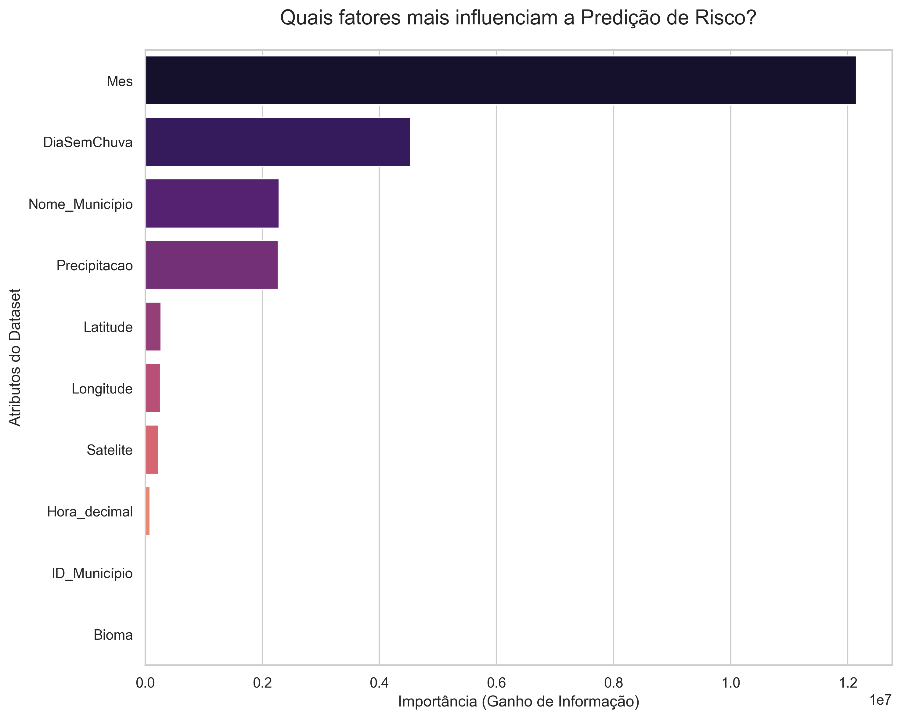

- Geografia é Destino: Latitude e Longitude aparecem como os fatores mais críticos. Isso indica que a localização geográfica em Minas Gerais é o preditor mais forte de incêndio, possivelmente devido a padrões históricos e topografia.
- Fator Humano/Local: O ID_Município e Nome_Município têm alta relevância, sugerindo que certas gestões territoriais ou atividades econômicas locais influenciam diretamente o risco.
- Clima: O DiaSemChuva e a Hora_decimal completam o topo, validando que a ausência de precipitação e o horário do dia (pico de calor) são os gatilhos imediatos para o risco.